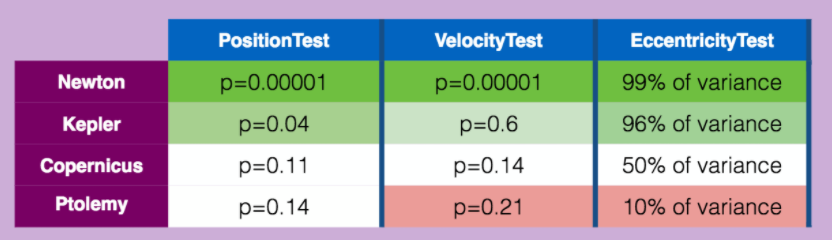
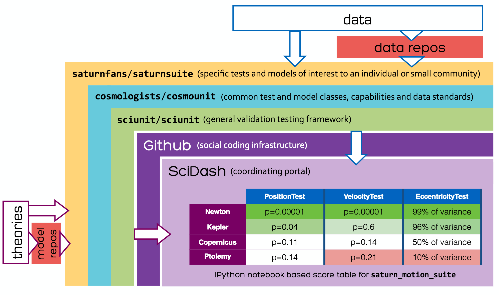

### Good scientific models are *formalized hypotheses* that can make predictions about system behavior. How can scientists evaluate the strength of a candidate model, or which one is best among many such models of the same system?

 
Which model best predicts the experimental observations? (Animation by @malincse)

### **SciDash** is a project that enables the reproducible execution and visualization of *data-driven unit tests* for assessing model quality.  It is a 21st century vision of the scientific method.

 
What if every competing model was transparently evaluated against a suite of unit data-driven tests?

# **Core Technologies**

<table>
  <tr>
    <td width="33%"></td>
    <td>&nbsp;</td>
    <td width="33%"></td>
    <td>&nbsp;</td>
    <td width="33%"></td>
  </tr>
  <tr>
    <td width="33%"><a href="sciunit.html">SciUnit</a>, a Pythonic framework for data-driven unit testing that separates the interface from the implementation, respecting the diversity of conventions for modeling and data collection.</td>
    <td>&nbsp;</td>
    <td width="33%"><a href="neuronunit.html">NeuronUnit</a>, an extensible SciUnit-driven library for the testing of neuron, neural circuit, and ion channel models using common simulators against multiple data sources.</td>
    <td>&nbsp;</td>
    <td width="33%">A <a href="portal.html">SciDash portal</a> to identify test repositories on GitHub, make it easy to locate them, execute suites of unit tests locally or in the cloud, and visualize results online with rich markup.</td>
  </tr>
</table>

## The SciDash project aims to make validation of scientific models against experimental data easy, transparent, and continuously integrated into the model development process.

## Let's identify the best models together!
